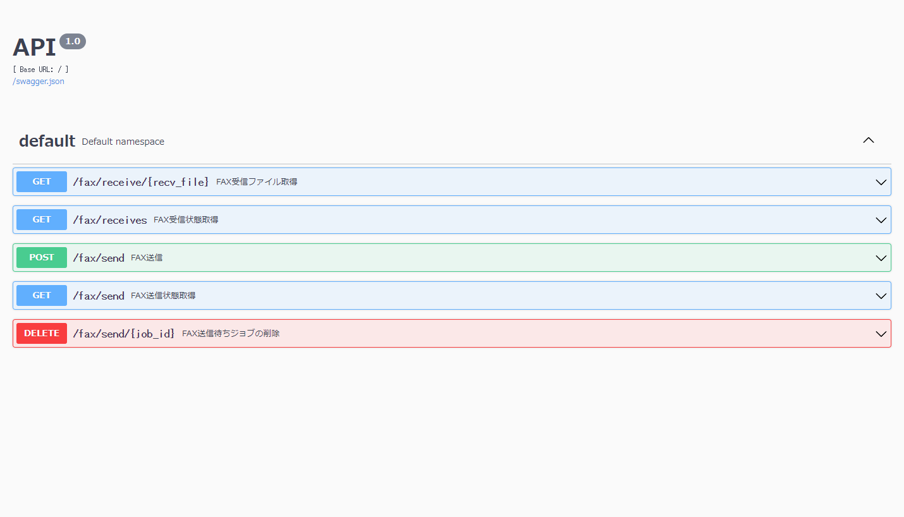

# fax_api
api for fax

### 概要
- [Hylafax](https://www.hylafax.org/)がインストールされている環境で、FAXの送受信をAPI経由で行うものです。
- フロントエンドは未対応ですが、SwaggerUIによりブラウザから操作可能です。


### 環境
- Hylafaxがインストールされていること
- Python3.8以上がインストールされていること
- 使用ライブラリ
  - Flask
  - Flask-RESTX
- [RasPBX](http://www.raspbx.org/)の[FAX機能](http://www.raspbx.org/documentation/#fax)がインストールされたRaspberryPIでの動作を確認しています。

### インストール
```sh
user@raspbx:~/fax_api $ echo 'RcvFmt: "%Y,%p,%s,%h,%f"' > ~/.hylarc
user@raspbx:~/fax_api $ . .venv/bin/activate
(.venv) user@raspbx:~/fax_api $ pip install -r requirements.txt
```
- 受信状態取得結果のフォーマットを定義するため、`~/.hylarc`の記述が追加になりました。

### 実行
- 下記コマンドで実行し、`http://IPアドレス:5000`でブラウザからアクセス。
```sh
(.venv) user@raspbx:~/fax_api $ tmux new-session -d 'python src/fax_api.py'
```
### 機能
1. FAX送信
    - パラメータ
      - 送信先電話番号
      - 送信ファイル
1. FAX送信状態取得
    - パラメータなし
1. FAX送信ジョブの削除
    - パラメータ
      - 送信ジョブID（FAX送信のレスポンスから取得可能）
1. FAX受信状態取得
    - パラメータなし
1. FAX受信ファイル取得
    - パラメータ
      - 受信ファイル名